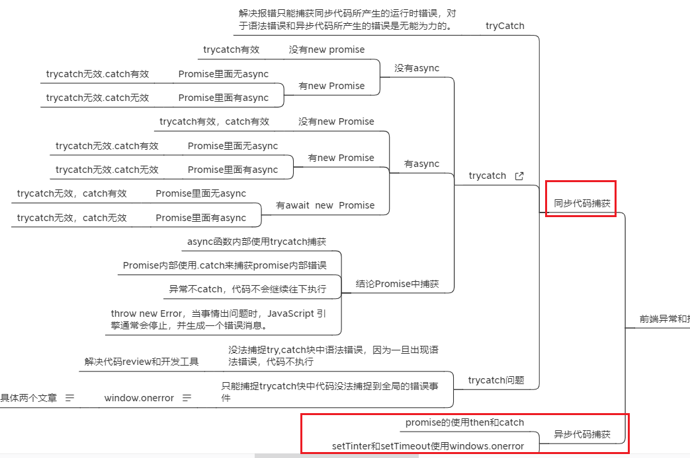

# 前端埋点

# 前端监控

开源免费好用的 bug 埋点追踪系统：sentry

## sentry 的特性

- 发送错误通知
- 给出客户端相关信息，包括浏览器版本、操作系统和请求内容等
- 代码版本（release 版本号）
- 上传代码源文件（source map）

## 1.如何使用

### （1）注册账号并创建项目

https://sentry.io/
点击个人的账号后，进入选择：
Install Sentry

### （2）找到 user Settings，选择中文。

### （3）将自己案例中的代码赋值到项目中，这里选择 Vue2 为例

```
// # Using npm
// npm install --save @sentry/vue @sentry/tracing
import * as Sentry from "@sentry/vue";
import { BrowserTracing } from "@sentry/tracing";


Sentry.init({
  Vue,
  dsn: "https://6cb22222222222222222222222226.ingest.sentry.io/4504196373872640",
  integrations: [
    new BrowserTracing({
      routingInstrumentation: Sentry.vueRouterInstrumentation(router),
      tracePropagationTargets: ["localhost", "my-site-url.com", /^\//],
    }),
  ],
  // Set tracesSampleRate to 1.0 to capture 100%
  // of transactions for performance monitoring.
  // We recommend adjusting this value in production
  tracesSampleRate: 1.0,
});

```

### （4）测试某处崩溃

```
   mysentryFn(e) {
      const a = {}
      //此处同样会报错
      console.log(a.name.name)
      //抛出错误
      new Error('抛出错误')

    },
    这样界面的问题菜单栏目，出现相关内容


```

### （5）高级功能，在关键错误处，弹出窗口

```
Sentry.init({
  dsn: "your dsnxxxxxxxxx",
  beforeSend(event, hint) {
    // Check if it is an exception, and if so, show the report dialog
    if (event.exception) {
      Sentry.showReportDialog({ eventId: event.event_id });
    }
    return event;
  },
});


```

### 6.可以通过 environment 区分环境

```
Sentry.init({
  environment: process.env.NODE_ENV,

```

### 7.自定义 bug 信息

```

还有可以自定义 bug 上下文信息
Sentry.setUser({"email": "xx@xx.cn"});
Sentry.setTag('api', 'api/list/get')
Sentry.setLevel('error');
Sentry.setExtra('data', {
  req: {a:1},
  res: {b:1},
  header:headers
})
Sentry.captureException(new Error('throw new api'))


```

### 8.项目案例地址
[案例项目地址sentry](https://gitee.com/nyhxiaoning/vue-antd-admin.git)

### 9.相关的错误处理汇总方案1：processOn
[processOn错误处理](https://www.processon.com/mindmap/6214476d079129079ad749e1)


### 10.常用错误处理方案汇总
（1）给所有的await都包裹，try,catch


（3）汇总展示报错

